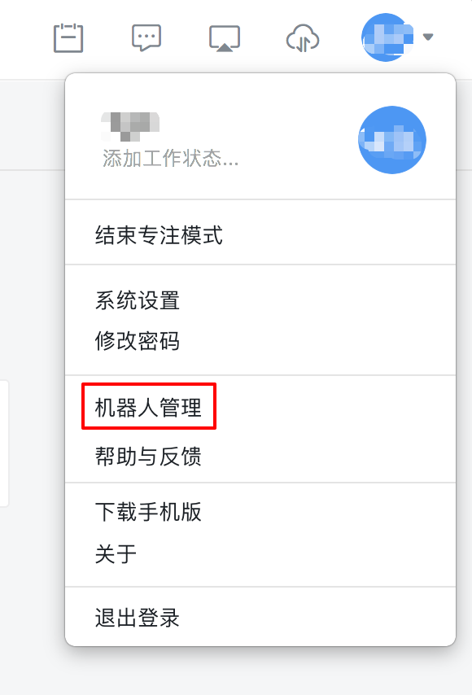
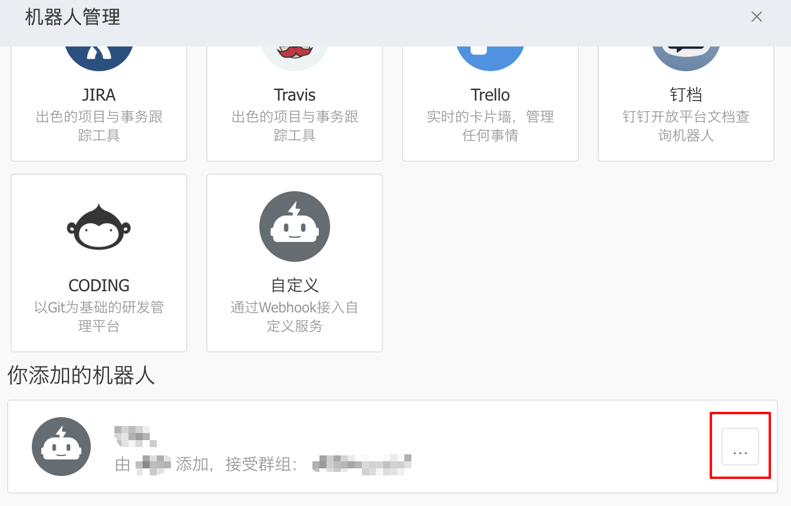
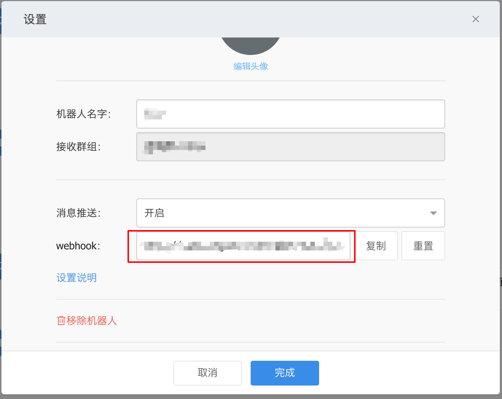
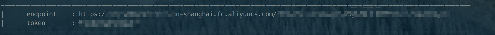
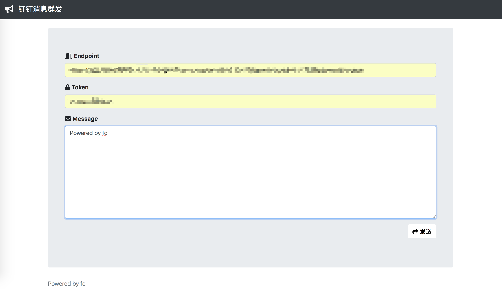

# 钉钉消息群发

## 主要特色
- 利用函数计算，一键部署钉钉机器人群发私服，解放双手
- 通过鉴权认证，避免私服泄漏

## 使用方法
1. 开通 [阿里云函数计算服务](https://cn.aliyun.com/product/fc?spm=5176.10695662.1112509.1.572e4357qoGwrS)

2. git clone https://github.com/awesome-fc/dingtalk-broadcast.git

3. 在项目目录下的 __urls.txt__ 文件中，输入要使用的群发机器人的 webhook

   webhook地址：
   - 点击 __钉钉桌面版__ 右上角的个人名片，选择 __机器人管理__ 
     
     

   - 在机器人管理页面中，可以选择新增自定义机器人，也可以在已添加的自定义机器人列表中，点击 `...` 按钮，获取 webhook 地址
      
     
     
   
   urls.txt 格式：

   ```
   # 可以在每一行通过 ‘#’ 号，添加注释

   # 群 1
   https://oapi.dingtalk.com/robot/send?access_token=123456

   # 群 2
   https://oapi.dingtalk.com/robot/send?access_token=456789
   ```

4. 执行项目目录下的 __deploy.sh__ 文件，命令行将会输出 `endpoint` 与 `token`，同时会打开浏览器并跳转到 __钉钉消息群发__，`endpoint` 与 `token` 默认会填写，此时只需要填写要群发的 __消息__，点击发送即可
   

   

5. 此后要发送消息，只需要执行项目目录下的 __start.sh__ 文件，或直接浏览 __钉钉消息群发__ 并填写 `endpoint` 、 `token` 与要发送的消息即可

6. 如果要修改机器人信息，可以在 __urls.txt__ 文件中修改机器人信息，并重新执行 __deploy.sh__
